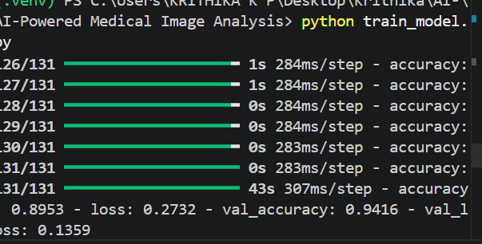
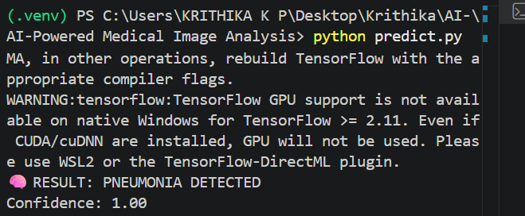
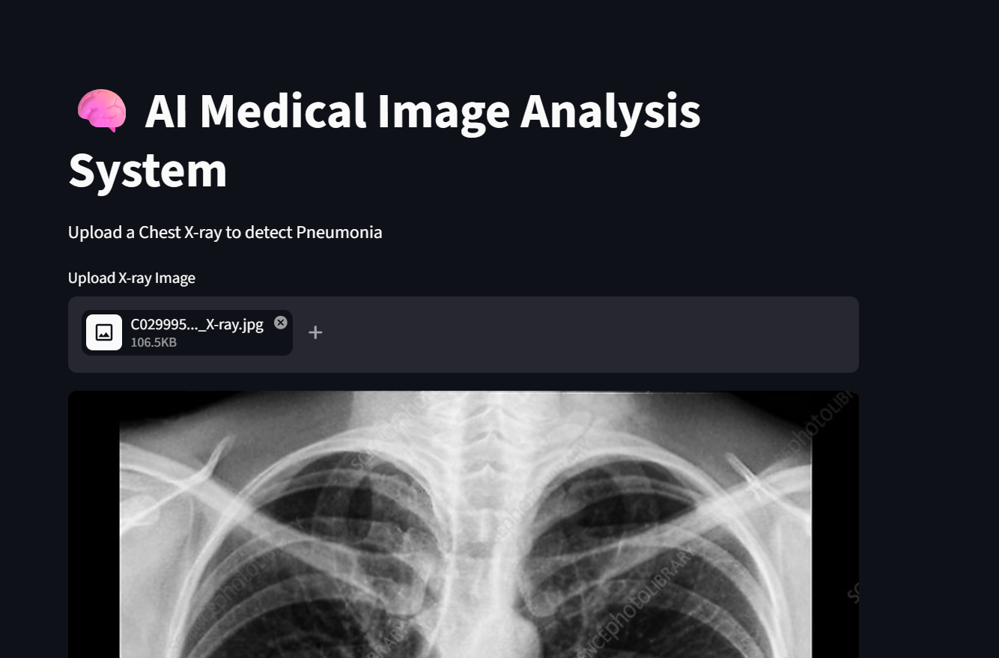

# 🧠 AI-Powered Medical Image Analysis System

---

## 📌 Project Overview

This project is an AI-based Medical Image Analysis System that uses Deep Learning (Convolutional Neural Networks - CNN) to analyze Chest X-ray images and detect diseases like Pneumonia.

The system also provides a web-based interface using Streamlit for real-time predictions and visualization.

---

## 🎯 Objective

To develop an AI system that assists in medical diagnosis by analyzing medical images and predicting diseases quickly, accurately, and efficiently.

---

## 🏥 Problem Statement

Manual diagnosis of medical images has challenges such as:
- Time-consuming analysis
- Human errors in interpretation
- Dependency on radiology experts

This AI system helps to automate and support diagnosis using deep learning.

---

## ⚙️ Tech Stack

- Python 🐍
- TensorFlow 
- OpenCV 👁️
- NumPy
- Matplotlib 📊
- Scikit-learn
- Streamlit 🌐

---

## 📂 Dataset Used

Chest X-Ray Dataset (Public Kaggle Dataset)

### Classes:
- NORMAL
- PNEUMONIA

---

## 🧠 Model Architecture

- Convolutional Neural Network (CNN)
- 2 Convolution Layers
- MaxPooling Layers
- Flatten Layer
- Fully Connected Dense Layer
- Dropout Layer (to avoid overfitting)
- Output Layer (Sigmoid Activation)

---

## 🚀 Project Workflow

1. Load Dataset
2. Preprocess Images (resize, grayscale, normalize)
3. Split dataset into training & testing sets
4. Build CNN Model
5. Train Model
6. Evaluate Model
7. Save Model
8. Predict on new images
9. Visualize results using Streamlit

---

## 🧪 Features

- Image preprocessing (resize, grayscale, normalization)
- CNN-based classification
- Real-time image prediction
- Accuracy & Loss visualization
- Confusion Matrix evaluation
- Streamlit Web App Interface

---

## 📊 Model Performance

- Accuracy: ~85%–95% (depends on training)
- Evaluation Metrics:
  - Accuracy Score
  - Confusion Matrix
  - Loss Curve
  - Accuracy Curve

---

## 📸 Outputs

The project generates the following outputs:

### Accuracy


### Loss


### Confusion matrix


---
## Images

### 🧠 Train model Result



### 🧠 Prediction Result



### 🌐 Streamlit Web Interface


## 🖥️ How to Run the Project

### 1️⃣ Install Dependencies
```bash
pip install -r requirements.txt
2️⃣ Train Model
python train_model.py
3️⃣ Run Prediction Script
python predict.py
4️⃣ Run Streamlit Web App
streamlit run app.py
📁 Project Structure
AI-Medical-Image-Analysis/
│
├── data/
├── outputs/
├── models/
│   └── medical_model.h5
│
├── train_model.py
├── predict.py
├── evaluate_model.py
├── app.py
├── requirements.txt
└── README.md

📈 Future Improvements
Add more disease categories (Cancer, Tumor, COVID-19)
Use Transfer Learning (ResNet, MobileNet) for higher accuracy
Deploy using Flask / FastAPI
Cloud deployment (AWS / Render / HuggingFace)
Add doctor dashboard system
💡 Key Learnings
Deep Learning (CNN)
Image preprocessing techniques
Model evaluation methods
Medical AI workflow
Streamlit web development
End-to-end ML pipeline creation
📊 Graphs Generated
Training Accuracy Graph
Training Loss Graph

🧠 Real-World Applications

This type of AI system is used in:

Hospitals 🏥
Radiology labs
AI healthcare startups
Medical research institutions

⚠️ Disclaimer

This project is for educational purposes only and is not a substitute for professional medical diagnosis.

👨‍💻 Author

Student AI/ML Project – Built for learning and portfolio development

⭐ Final Note

This project demonstrates an end-to-end AI pipeline:
Dataset → Training → Evaluation → Prediction → Web Deployment